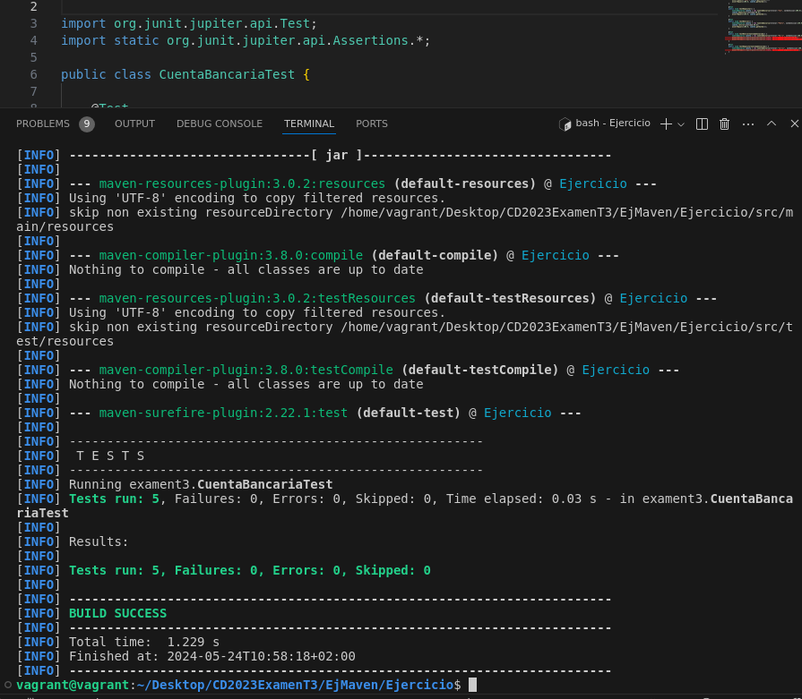
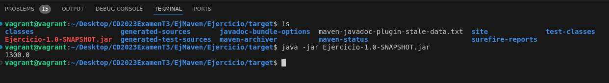

<h1>Ejercicio 1</h1>
Para este primer ejercicio primero he introducido el archivo en el proyecto Maven previamente creado, he comentado la clase, y después he aplicado el proceso para generar la documentación. Primero he editado el Pom (para que se corresponda con la versión instalada de Java y demás), después compilado con el comando "mvn compile", y por último generado la documentación con "mvn javadoc:javadoc".

<h1>Ejercicio 2</h1>
Para este apartado he introducido la clase CuentaBancariaTest.java en la clase de Test correspondiente dentro del proyecto de Maven. He ejecutado el comando pertinente "mvn test" y ha pasado sin incidencias las 5 pruebas que contiene la clase.



<h1>Ejercicio 3</h1>
Primero he creado la clase App.java con su metodo main, y dentro he creado el objeto CuentaBancaria con sus respectivos atributos, he usado el método depositar, y he recuperado el resultado usando getSaldo. Después con el comando "mvn package" he creado el .jar, y editado el Pom después introduciendo:

```
<plugin>
    <artifactId>maven-jar-plugin</artifactId>
    <version>3.0.2</version>
    <configuration>
    <archive>
        <manifest>
        <addClasspath>true</addClasspath>
        <mainClass>exament3.App</mainClass>
        </manifest>
    </archive>
  </configuration>
</plugin>
```
Luego me he desplazado en la terminal a la ubicación donde se ha creado el .jar, la carpeta "target", y con el comando "java -jar Ejercicio-1.0-SNAPSHOT.jar" (nombre del archivo por defecto) lo he ejecutado y ha mostrado la respuesta esperada.

